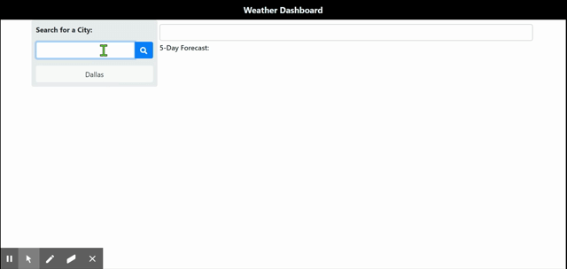

# weather-dashboard

weather-dashboard allows users to search current and future weather conditions by city. It runs in the browser and features dynamically updated HTML and CSS powered by jQuery. Check it out <a href="https://nwuerz.github.io/weather-dashboard/" target="_blank">here</a>!

## Technologies

- HTML
- CSS
- JQUERY
- AJAX
- OpenWeather API